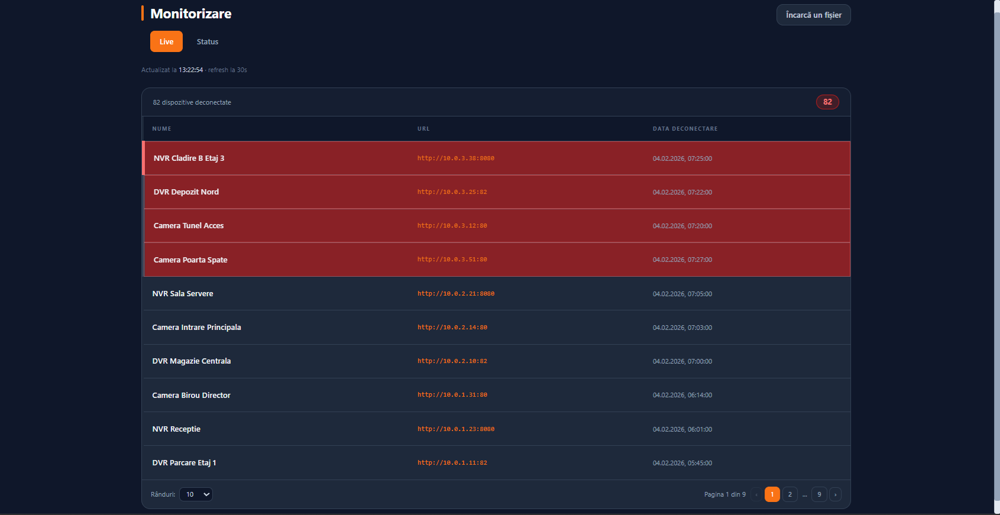
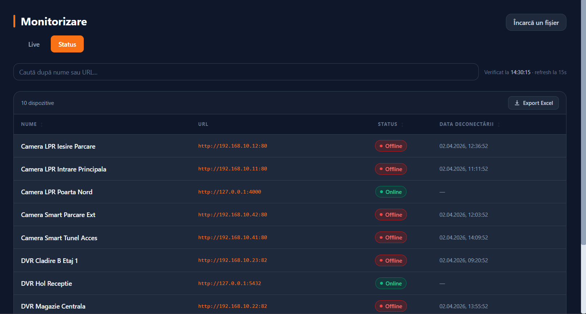
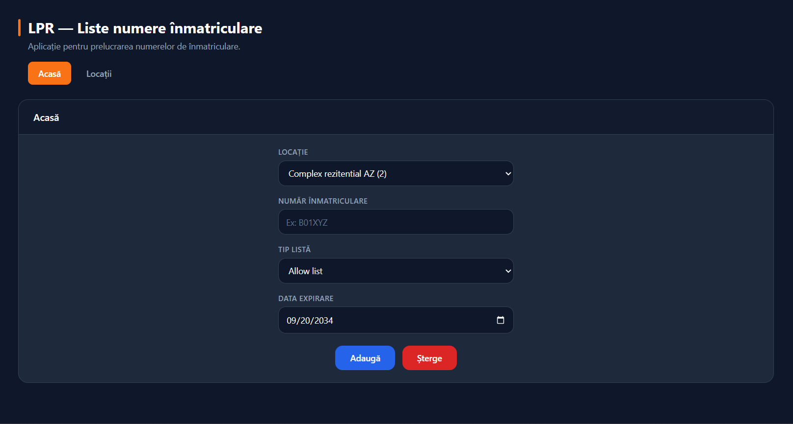
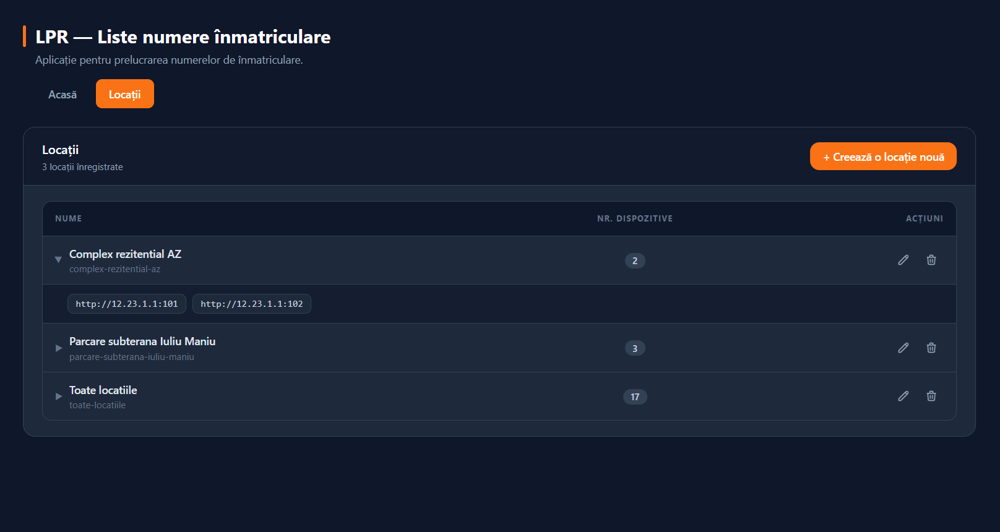
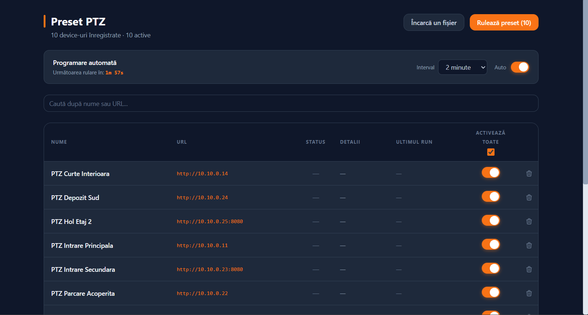
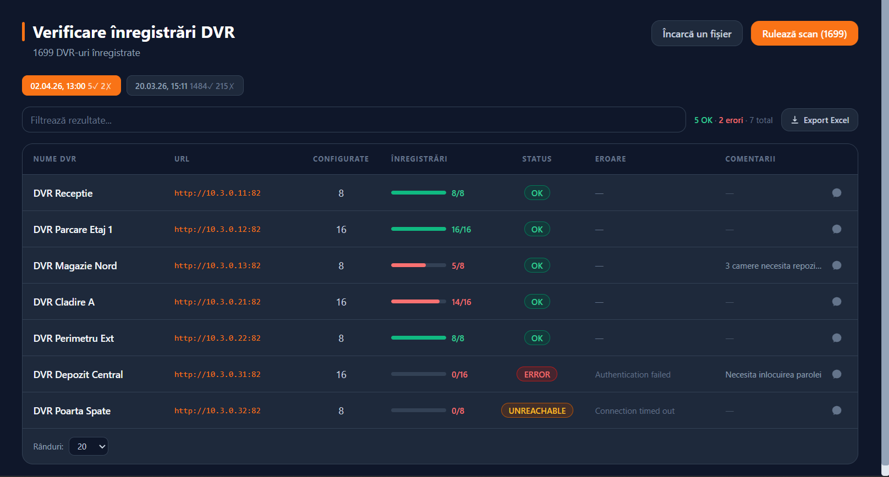

# Devices Management

Platformă web pentru monitorizarea și administrarea centralizată a echipamentelor de securitate (camere IP, DVR-uri, camere LPR și camere PTZ) distribuite în mai multe locații.

## Motivația proiectului

Administrarea unei infrastructuri de securitate distribuite pe mai multe locații înseamnă, în mod tradițional, acces manual pe interfața fiecărui echipament în parte: verificare status, actualizare liste de acces, repoziționare camere PTZ, verificare înregistrări DVR. Am construit această platformă pentru a elimina acest proces repetitiv și a agrega totul într-un singur punct de control web.

## Ce face platforma

- **Monitorizare dispozitive** — status online/offline pentru toate echipamentele, cu polling automat și semnalare imediată a deconectărilor
- **Liste LPR** — administrare centralizată a listelor de numere de înmatriculare (allow/block list) pe camerele de recunoaștere, operabilă simultan pe toate camerele unei locații
- **Preset PTZ** — automatizarea comenzilor Pan-Tilt-Zoom pentru un număr mare de camere, cu rulare manuală sau programată la interval configurabil
- **Verificare înregistrări DVR** — audit automat, în paralel, al DVR-urilor dintr-o listă importată din Excel, cu statusuri clare (OK / ERROR / UNREACHABLE) și export al rezultatelor

## Impact

| Proces | Înainte | După |
|---|---|---|
| Detectare dispozitiv deconectat | Ore, reactiv | Secunde, proactiv (polling automat la 30s) |
| Adăugare număr în liste LPR | Acces manual pe fiecare cameră | O singură operațiune centralizată |
| Rotire preset PTZ | Operator dedicat | Scheduler automat |
| Audit înregistrări DVR | Ore de verificare manuală | Scan automat + raport Excel |

## Module și capturi de ecran

### Monitorizare — Live
Listă actualizată automat a echipamentelor deconectate din rețea, cu nume, URL și momentul exact al deconectării.

### Monitorizare — Status
Vizualizare centralizată a stării Online/Offline pentru toate dispozitivele, cu căutare și export Excel.

### LPR — Acasă
Adăugare sau ștergere a unui număr de înmatriculare din allow list / block list, aplicată simultan pe toate camerele unei locații.

### LPR — Locații
Configurarea structurii organizaționale: fiecare locație grupează un set de dispozitive, reutilizabil în toate operațiunile ulterioare.

### Preset PTZ
Rulare manuală sau programată a preseturilor PTZ pentru toate camerele active, cu activare/dezactivare individuală.

### Verificare înregistrări DVR
Scan automat în paralel al DVR-urilor importate din Excel, cu comparație între camere configurate și camere cu înregistrări active.

## Stack tehnic

Aplicație web full-stack, cu integrare directă pe protocoalele camerelor IP/LPR/PTZ și DVR-urilor (Hikvision), procesare de evenimente în timp real și generare de rapoarte exportabile (Excel).

*Notă: datele afișate în capturile de ecran (nume de dispozitive, adrese IP, locații) sunt date demonstrative.*
